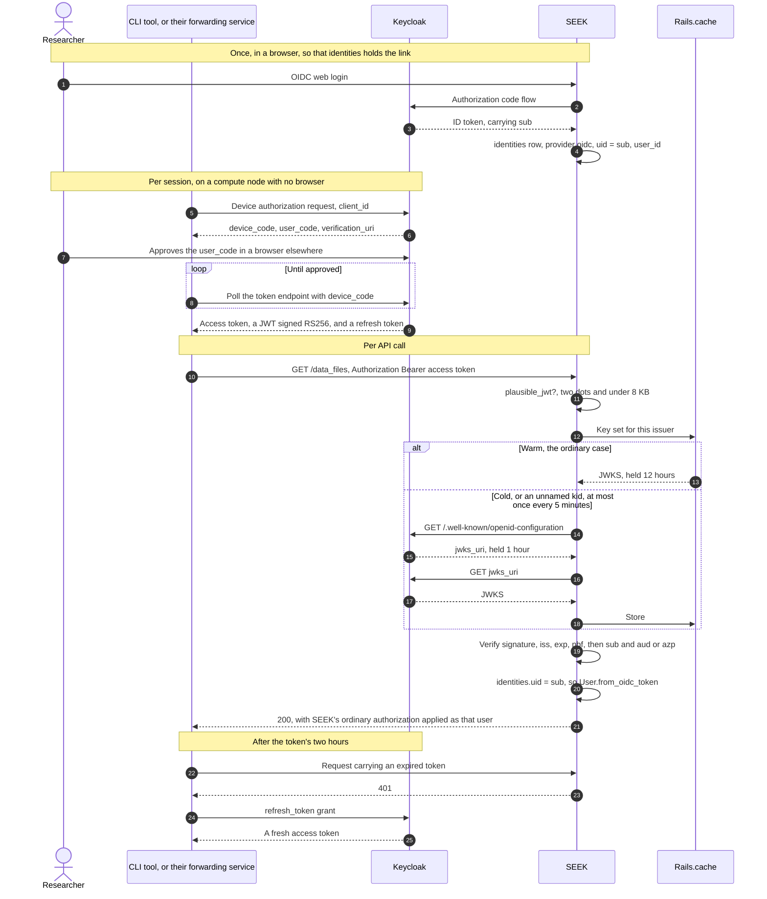

# Accepting an OpenID Connect access token as an API credential

Implements [#2733](https://github.com/seek4science/seek/issues/2733), on `openid-api-2733`.

## The problem

SEEK could already sign a person in through an OpenID Connect provider, and it recorded which
SEEK user each provider identity belonged to. It could not accept an access token from that
same provider as a credential for the API.

The requester's institution runs Keycloak, federated to SURFconext, as the identity provider
for everything their researchers use, SEEK included. They are building a command line tool for
researchers on compute nodes: it signs in with the OAuth device authorization grant, which
suits a machine with no browser, and then calls a data access layer of theirs which forwards
the caller's credential to SEEK so that every permission check and every deposit is evaluated
as that person. Their service deliberately holds no identity of its own.

The chain broke at the last step. Because SEEK would not accept the Keycloak token, their
service had to obtain and keep a *second* SEEK credential for each user. The only workable one
is a SEEK API token, which:

- never expires;
- cannot be created through the API, so each researcher must visit their profile, create one,
  copy it, and paste it into a web interface;
- stays valid after somebody leaves the institution, because revocation, multi-factor policy
  and deprovisioning all live with the institution's identity provider, not with SEEK.

An OAuth access token from SEEK's own provider was no better: it expires after two hours, so
holding one on somebody's behalf means also storing and renewing a long-lived refresh token.

## The flow

Three exchanges, only the third of which is new. The link between a provider subject and a SEEK
user is established once, in a browser; the token the tool then presents is the provider's own,
and SEEK verifies it against the provider's published keys rather than asking the provider about
it.



A token that fails any of those checks yields no user, and the request falls through to the rest
of the chain — in practice to `user_from_api_token`, which misses too and answers 401.

## What already existed

Most of the mechanism was in place. `SessionsController#omniauth_authentication`
(`app/controllers/sessions_controller.rb:146`) writes a row into `identities` on every OIDC web
login, with `provider` set to `'oidc'` and `uid` set to the token's `sub` claim — the
`omniauth_openid_connect` strategy's `uid_field` default, which SEEK does not override.

That table stores no tokens at all. It holds only `provider`, `uid` and `user_id`
(`db/schema.rb:934`); token columns were added in 2019 and dropped again by
`db/migrate/20191219112818_remove_unused_identity_fields.rb`.

So the question "which SEEK user is this subject?" was already answerable, and kept up to date
by ordinary logins. The only missing piece was a way to establish that a bearer token really
came from the provider and really concerned that subject.

Two of the three gems needed were already there. `openid_connect` (2.3.1) fetches a discovery
document, and `jwt` (3.2.0) verifies a token and its claims — the latter was in the lockfile as
a dependency of `oauth2`, and is now declared directly. `json-jwt` remains only as
`openid_connect`'s own dependency; no SEEK code calls it.

## What was added

### `Seek::OIDC::Discovery` — `lib/seek/oidc/discovery.rb`

Finds the provider's signing keys through its discovery document and caches them, so that
verifying a token normally needs no request to the provider at all.

```ruby
Seek::OIDC::Discovery.new(issuer).key_set(invalidate: false)  # => JWT::JWK::Set
```

That signature is the one ruby-jwt's key finder asks for. It calls the loader again with
`invalidate: true` when a token names a key the set does not hold, which is how a rotated key
gets picked up — so the library decides *when* to retry, and this class decides only how often
it is willing to be asked.

Everything is cached in `Rails.cache`, under keys hashed on the issuer rather than its host so
that adding a second provider later needs no change here:

| Cached | TTL |
| --- | --- |
| The key set, as raw JSON | 12 hours |
| `jwks_uri` from the discovery document | 1 hour |
| Key-rotation refresh cooldown | 5 minutes |
| "Provider unreachable" marker | 1 minute |

`jwks_uri` is resolved lazily *inside* the key-set fetch, so a warm cache costs one read and no
HTTP.

### `Seek::OIDC::AccessTokenVerifier` — `lib/seek/oidc/access_token_verifier.rb`

```ruby
Seek::OIDC::AccessTokenVerifier.enabled?      # => is this configured and switched on?
Seek::OIDC::AccessTokenVerifier.verify(token) # => claims Hash, or nil. Never raises.
```

A cheap shape test, then a single `JWT.decode` carrying the algorithm allowlist, the key set
loader, the required claims, the issuer and the leeways. Two checks remain by hand afterwards:
a blank subject, because `required_claims` asserts only that a claim is present, and the
audience, because ruby-jwt knows nothing of `azp`.

### `User.from_oidc_token` — `app/models/user.rb:320`

Mirrors the existing `User.from_api_token`, which keeps the new link in the authentication
chain to a single line and puts the one log message an administrator actually needs — a token
verified for a subject that no account is linked to — where the claims are still in scope.

### The chain entry — `lib/authenticated_system.rb:15,151`

```ruby
self.current_user = (user_from_session || user_from_doorkeeper || user_from_basic_auth ||
                     user_from_cookie || user_from_oidc_token || user_from_api_token)
```

### Settings

Two, both administered under *Admin* → *Enable/disable features*, inside the Omniauth block
next to the provider's existing settings:

| Setting | Default | Meaning |
| --- | --- | --- |
| `omniauth_oidc_api_enabled` | `false` | Accept the provider's access tokens for the API |
| `omniauth_oidc_api_audiences` | `''` | Accepted `aud`/`azp` values, comma separated |

`Seek::Config.omniauth_oidc_api_audience_list` parses the second into an array, following the
existing `exception_notification_recipients` precedent.

### Documentation

`public/api/definitions/openapi-v3.yml` gains an `oidcBearerToken` security scheme and a new
`public/api/descriptions/authOidcToken.md`, in the style of the existing `authToken.md`. The
resolved spec files beside it are gitignored and regenerated at boot by
`config/initializers/resolve_api.rb`, so only the source is edited.

## How this solves the issue

An application holding a user's OIDC token can now call SEEK as that user, and no second
credential exists anywhere. Nothing is created, copied, pasted or stored. Tokens expire on
their own. Revocation, multi-factor policy and deprovisioning stay with the institution, which
removes the risk of credentials outliving somebody's employment — the requester's main concern.

Once a token resolves to a user, that request is treated exactly as an API-token request would
be: SEEK's normal authorization applies in full. The token establishes *who* is calling; it
grants nothing by itself.

## Reasoning

### Verifying locally rather than asking the provider

Three options were available: verify the token as a JWT against the provider's published keys,
call the provider's introspection endpoint, or call its userinfo endpoint.

Local verification was chosen. Introspection and userinfo both add a network round trip to
*every* authenticated API request and make SEEK's API unavailable whenever the provider is
down. Userinfo is worse still: it returns no `aud` or `azp`, so the audience could not be
checked at all — see below for why that matters.

The cost is that a token revoked at the provider stays usable here until it expires. That is
bounded by the provider's access token lifetime, around five minutes on a Keycloak default, and
is stated plainly in the API documentation. It requires the provider to issue JWT access
tokens, which Keycloak and most modern providers do.

### The audience check, and why it is the security crux

A signature proves who *issued* a token. It does not prove who the token was *for*.

On the web login path SEEK is the client: it redirects the user and exchanges the code itself,
so it knows any token it receives is its own. On the API path SEEK is a resource server — the
token arrives from a caller SEEK knows nothing about, and SEEK took no part in obtaining it.
The only way SEEK can know a token was meant for it is if the token says so.

Without an audience check the consequence is concrete. An institutional provider serves many
applications. If a user signs into any one of them, that application holds a genuine,
unexpired, correctly signed token bearing that user's subject — and could present it to SEEK
and act as that user, reading, altering and deleting their data. The user consented to that
application learning who they are, not to it acting as them in SEEK. This is the confused
deputy problem, and the audience claim is the standard defence.

Both `aud` and `azp` are accepted, because a provider commonly names the resource in one and
the calling application in the other. Keycloak sets `azp` to the client that requested the
token and often leaves `aud` as `["account"]` unless an audience mapper is configured. So in
the topology above the administrator lists the command line tool's client id, and what they are
really saying is *these applications may act as my users in SEEK*.

The check is **optional**, and empty means no check at all. That is a deliberate decision: it
is reasonable for an institution that controls every client registered with its provider, and
unreasonable for a large federated provider where third parties can register clients. Two
things carry the risk instead:

- the feature is **off unless enabled**, so an instance that has not considered the question is
  not exposed;
- the admin help text states the consequence of leaving it blank in full. That copy is
  load-bearing, not decoration.

The default is blank rather than SEEK's own client id, which might look like the safer choice.
It is not: that value is an *ID token's* audience, and Keycloak access tokens do not carry it.
Defaulting to it would reject every legitimate token out of the box, and administrators would
"fix" it by clearing the field — arriving at blank anyway, but without having read the warning.

### Where it sits in the authentication chain

Position matters in both directions.

It must come **before** `user_from_api_token`, which does `sleep 2 if Rails.env.production?`
on every miss. Behind it, every OIDC-authenticated request would have paid two seconds.

It sits **after** `user_from_doorkeeper`, which is safe because `doorkeeper_token` finds no
record for a foreign token and returns nil. `check_doorkeeper_scopes`
(`app/controllers/application_controller.rb:35`) is guarded by `if: :doorkeeper_token`, so an
OIDC token never trips the OAuth scope checks, and existing precedence for real OAuth tokens is
untouched.

That ordering also means failed OIDC authentication needs no new throttling: a rejected token
falls through to `user_from_api_token`, whose block still runs — Rails' `TOKEN_REGEX` matches
`Bearer` as well as `Token` — misses, and applies that same two-second penalty in production.

### No extra privilege gate

OAuth clients are restricted to allowlisted `api_actions` with read/write scopes. That was not
extended to OIDC tokens: the token authenticates a person, and SEEK's ordinary authorization
then applies, exactly as for an API token or HTTP basic auth. Adding a second, subtly different
scope-checking path would have meant more surface to get wrong for no clear gain, and the issue
asks for a credential equivalent to an API token.

### No account creation

If a token verifies but no identity matches its subject, the result is no user and the request
fails. Accounts are created only on the interactive login path, which is also where a `Person`
profile gets completed — something a headless API caller cannot do. In practice a researcher
signs into SEEK through the provider once in a browser, and everything after that is automatic.

### An enable setting of its own

The issue suggested this and it was worth taking: an instance can allow OIDC for logging in
without allowing it for the API. Because the setting is read per request, turning it on needs
no restart, unlike the provider itself, which is wired into the middleware at boot.

### Clock leeway on one side only

`exp` is honoured exactly as issued: `exp_leeway: 0`. Leeway of 60 seconds applies only to
`nbf`, via `nbf_leeway`.

The asymmetry is deliberate, because the two directions have opposite risk profiles. If SEEK's
clock lags the provider's, a token minted moments ago is dated in SEEK's future and would be
refused; that failure is intermittent, invisible to the caller, and unfixable by them —
retrying makes it worse, as the new token is dated later still. Being strict there protects
against nothing, since forging claims requires the signing key.

`iat` is not verified at all. It describes when a token was made rather than bounding when it
may be used, and ruby-jwt allows it no leeway whatsoever (`claims/issued_at.rb`), so enabling
it would refuse exactly the freshly minted token described above.

Leeway against `exp` is the reverse. The failure it would avoid is benign and self-correcting —
the caller fetches a fresh token, which a device-flow client does anyway — while the cost is
lengthening the one window this design already concedes, in which a token the provider has
revoked still works. Spending that allowance to save a retry is the wrong way round.

### Not using the libraries' own caching hooks

`JSON::JWK::Set::Fetcher.cache = Rails.cache` is the conventional hookup and was rejected.
Its cache key embeds the key id, and it deletes the entry whenever the fetched set does not
contain that id. A caller sending tokens bearing invented key ids would therefore force one
outbound request to the provider *per request* — an unauthenticated amplification vector
against the institution's provider, and a latency sink for SEEK. Worse, the discovery response
calls that fetcher with no options, so entries would be cached with no expiry and a genuinely
rotated key would never be picked up.

`SWD.cache = Rails.cache` was rejected too: its cache key is the host alone, so two issuers
sharing a host would collide, and it is shared with the browser login path.

ruby-jwt offers no caching of its own — its key set loader is the hook, and what it caches is
our business. So caching explicitly is the only option in any case: it stores only strings,
under SEEK's own namespaced keys, with chosen expiries, and changes nothing about web login.

### Bounding what an attacker can cost the provider

Key rotation still has to work, so an unrecognised key id does trigger a refetch — but at most
once every five minutes across the whole deployment, guarded by a cache write with
`unless_exist: true`. That becomes Redis `SET NX`, a single atomic operation, so the bound holds
across every worker rather than merely within one process. A genuine rotation is picked up
within five minutes instead of twelve hours; a million invented key ids cost one request.

Separately, a provider that cannot be reached is remembered for a minute. `Rails.cache.fetch`
does not cache exceptions, so without this an outage would cost a fresh connection attempt, and
a full timeout, on every API request.

Requests to the provider use a connection with explicit 2s connect and 5s read timeouts rather
than `OpenIDConnect.http_client`, which imposes none. A hung provider would otherwise tie up
Puma threads. It is a separate connection because that gem holds its configuration in a class
variable shared with the browser login flow.

### Never raising

`verify` wraps its whole body in a single `rescue StandardError`. An unusable credential has to
mean nobody is logged in, and a failure of a library or of the provider must not turn every
request carrying a bearer token into a 500. A blanket rescue rather than an enumerated list is
deliberate — the guarantee must hold for whatever the gems grow later — and the exception class
is logged so that a genuine bug stays visible.

### The algorithm allowlist

`SIGNING_ALGORITHMS` holds asymmetric algorithms only, and ruby-jwt insists on being given the
list — its default is `HS256`, so omitting it would be far worse than forgetting it elsewhere.
Restricting it is what rejects an unsigned token (`alg: none`) and the classic key-confusion
attack, where a token is signed `HS256` using the provider's *published public key* as the
shared secret. Both are covered by tests.

The list holds **strings**, which is the opposite of what `json-jwt` wants: that library
compares against `alg&.to_sym`, so a list of strings there silently matches nothing and rejects
every token. Anything moving between the two libraries has to change the type.

`JWT::Decode#decode_segments` compares the algorithm *before* it resolves a key
(`verify_algo` then `set_key`). That ordering is relied upon, not merely convenient: it is what
stops an unauthenticated caller reaching the key rotation refetch with tokens naming a junk
algorithm and an invented key id. A test asserts that such a token causes no key lookup, so the
library is held to it.

### `Seek::OIDC`, and the inflection

Zeitwerk derives the constant from the directory name, which initially gave the awkward
`Seek::Oidc`. `OIDC` is now registered as an acronym in `config/initializers/inflections.rb`
alongside `ISA`, `CWL` and the rest, exactly as `lib/seek/isa_graph_extensions.rb` becomes
`Seek::ISAGraphExtensions`. The directory name is unchanged.

Acronyms are global to `camelize` and `underscore`, so this was checked first: nothing else in
the application inflects a string containing "oidc", the provider settings being reached by
symbol rather than camelized.

The namespace must never be called `Seek::OpenIDConnect`, because unqualified references to the
gem of that name would then resolve to the SEEK namespace instead. Gem constants are written
`::JSON`, `::OpenIDConnect`, `::Faraday` throughout both files for the same reason.

## Known limits

These are properties of the design, documented rather than fixed:

- **Revocation.** A token revoked at the provider works here until it expires, capped by the
  provider's access token lifetime. Deprovisioning is still immediate in the way that matters:
  the identity lookup runs on every request, so removing the identity or the user cuts access at
  once.
- **ID tokens.** With no audience configured, an *ID* token from the same issuer satisfies every
  check and would authenticate. It is still a token the user legitimately holds and is bound to
  SEEK, so this is not a soundness break, but it is not the intended credential. The remedy is
  the audience setting, pointed at an audience only access tokens carry. Two code-level
  heuristics were considered and rejected: requiring `typ: at+jwt` per RFC 9068 breaks Keycloak,
  the target provider, and rejecting tokens bearing a `nonce` is provider-specific.
- **Discovery is always attempted over HTTPS**, whatever scheme the issuer is configured with,
  because the library rebuilds the URL from host, port and path. An `http://localhost` provider
  will not work. This affects web login identically today.
- **A cache outage widens the request bound.** If `Rails.cache` is unreachable, keys are fetched
  afresh per request and neither the cooldown nor the unavailability marker can be written. The
  application is already in trouble at that point, since the cache also backs sessions.
- **Inactive and partially registered users** are screened by no strategy in the chain, and
  `user_from_api_token` does not check either. Somebody with no `Person` is redirected to the
  registration page regardless of request format. Pre-existing for every credential type; the
  new strategy stays consistent rather than inventing a different rule.
- **Each token-authenticated request creates a session**, because `current_user=` writes
  `session[:user_id]`. Pre-existing for API tokens and basic auth, but worth knowing for a tool
  making many stateless calls.
- **Clearing the cache costs the outage buffer, not any login.** Nothing cached here is
  authentication state — it is the provider's *public* keys — so clearing it logs nobody out and
  invalidates no token; the next request refetches and succeeds. But until it is warm again SEEK
  cannot ride out a provider outage the way a twelve-hour key set otherwise lets it, and several
  concurrent requests will each fetch, since `Rails.cache.fetch` takes no lock. Redis is
  `allkeys-lru`, so eviction has the same effect without anyone acting. Note that
  `Rails.cache.clear` does not disturb sessions: the store is namespaced `cache` while sessions
  live under `session:`, so it deletes `cache:*` rather than flushing the database.
- **A provider that omits the key id is only supported where it publishes one key.**
  `allow_nil_kid` makes ruby-jwt take the first key in the set rather than trying each, so a
  provider that both omits `kid` and publishes several keys would fail. Keycloak always sets it.

## Alternatives considered

### Reusing the omniauth strategy

The first question a reviewer asks: SEEK already depends on `omniauth_openid_connect`, which
discovers the provider and verifies tokens — why not call it?

Because there is nothing to call. The strategy defines no class methods at all; every method is
an instance method on `OmniAuth::Strategy`, request-scoped Rack middleware needing an `env`,
its options and the session. Reaching it from the API path would mean building a strategy
outside the middleware stack and feeding it a synthetic env.

Two further reasons it would be wrong even if it were reachable. It verifies **ID** tokens —
`decode_id_token` ends at `OpenIDConnect::ResponseObject::IdToken`, whose `verify!` requires
`aud` to equal the client id and a `nonce` matching the session. A third-party access token has
neither, by design. And it caches nothing across requests: `config` and `public_key` are
memoised per instance, and `config.jwks` issues a fresh HTTP GET, which is one discovery and
one key set fetch *per login* — fine for a browser redirect, ruinous per API request.

### Verifying the claims by hand

The first implementation did the claim checking itself over `json-jwt`, which offers none: it
verifies a signature and leaves expiry, issuer, audience and required claims to the caller. It
worked and was fully tested, but it was around forty lines of security-relevant code
reimplementing a solved problem. `jwt` does all of it — including the asymmetric leeway, the
required-claims assertion and the retry on an unrecognised key id — so the checks were handed
over. What could not be handed over is in *Reasoning* above: `azp`, the optional audience, and
everything in `Discovery`.

### Introspection and userinfo

Covered under *Verifying locally rather than asking the provider*. Both add a round trip to
every authenticated request and make the API depend on the provider being up; userinfo also
returns no `aud` or `azp`, which would make the audience check impossible.

`rack-oauth2` (already present, via `openid_connect`) has an introspection client, and would be
the tool to reach for had that route been taken.

### Other gems

- **`faraday-http-cache`** could cache the key set from the provider's HTTP cache headers, but
  that depends on the provider sending sensible ones and provides none of the refresh cooldown
  or negative caching that bound what a caller can cost the provider.
- **`omniauth-keycloak`, `keycloak`** are provider-specific. The provider here is an
  administrator's setting, so tying the implementation to one product would be wrong even
  though Keycloak is the case that prompted the issue.
- **`devise-jwt`, `doorkeeper-jwt`** issue tokens. Consuming somebody else's is the opposite
  problem.

## Enabling it

1. Configure the OpenID Connect provider under *Admin* → *Enable/disable features* and
   restart, since providers are wired into the middleware at boot.
2. Tick **Accept … access tokens for the API**.
3. Set **Accepted token audiences** to the client id of each application that may call SEEK on a
   user's behalf. Read the warning before leaving it blank.
4. Each researcher signs into SEEK through the provider once, in a browser, and completes their
   profile. Their identity is then linked, and can be confirmed at `/users/:id/identities`.

Then:

```bash
curl -H "Authorization: Bearer $TOKEN" -H 'Accept: application/json' \
     https://your-seek/people/current
```

## Testing

43 new tests, all passing, and no regressions across the authentication, admin, omniauth, OAuth
and API suites.

| Where | Tests |
| --- | --- |
| `test/unit/oidc/access_token_verifier_test.rb` | 31 |
| `test/integration/authentication_test.rb` | 5 |
| `test/unit/user_test.rb` | 4 |
| `test/unit/config_test.rb` | 2 |
| `test/functional/admin_controller_test.rb` | 1 |

`test/oidc_test_helper.rb` holds the shared fixtures: a generated RSA key pair, a signed token
builder, and WebMock stubs for the discovery and key set endpoints. Signing with the private JWK
rather than the bare OpenSSL key is what puts the key id into the token header.

Those fixtures sign with `json-jwt` while the code verifies with `jwt`, so a token built by one
implementation is checked by the other. That is worth keeping: a suite where the same library
signs and verifies only proves it agrees with itself.

The negative cases carry most of the value: `alg: none`; `HS256` signed with the provider's
public key; a different key claiming the provider's key id; an altered payload; expired and
not-yet-valid tokens; a wrong issuer; a missing or blank subject; an unknown key id; and
credentials that are not tokens at all, asserting that no request to the provider is made.

Three tests pin behaviour that would otherwise be easy to regress, by counting requests:
one refetch for an unknown key id, *still* only one for a second unknown key id — the bound on
what an attacker can cost the provider — and no repeat discovery request while the provider is
marked unreachable.

Note that this suite resets WebMock explicitly. The automatic per-test reset from
`webmock/minitest` is not in effect here, because VCR hooks into WebMock, so request counts
otherwise accumulate across tests and the assertions above would be meaningless.

## Files

New:

```
lib/seek/oidc/discovery.rb
lib/seek/oidc/access_token_verifier.rb
public/api/descriptions/authOidcToken.md
test/oidc_test_helper.rb
test/unit/oidc/access_token_verifier_test.rb
```

Changed: `Gemfile` and `Gemfile.lock` (declaring `jwt`),
`lib/authenticated_system.rb`, `app/models/user.rb`, `lib/seek/config.rb`,
`lib/seek/config_setting_attributes.yml`, `config/initializers/seek_configuration.rb`,
`config/initializers/inflections.rb`, `app/controllers/admin_controller.rb`,
`app/views/admin/_omniauth.html.erb`, `public/api/definitions/openapi-v3.yml`, and the test
files above plus `test/factories/users.rb`.

No migration, and so no `seek:upgrade` task: `identities` already has the columns and the
`[provider, uid]` index the lookup uses, and new settings take their value from
`Seek::Config.default` until an administrator sets them.
