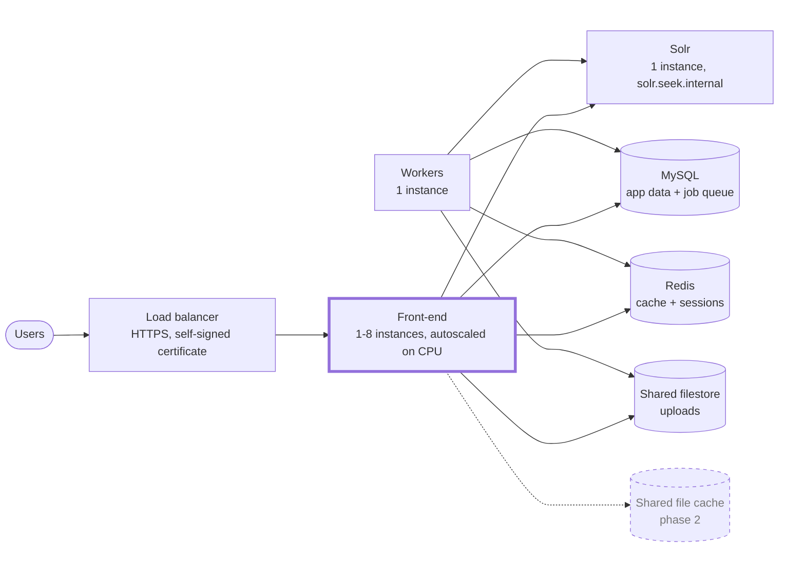
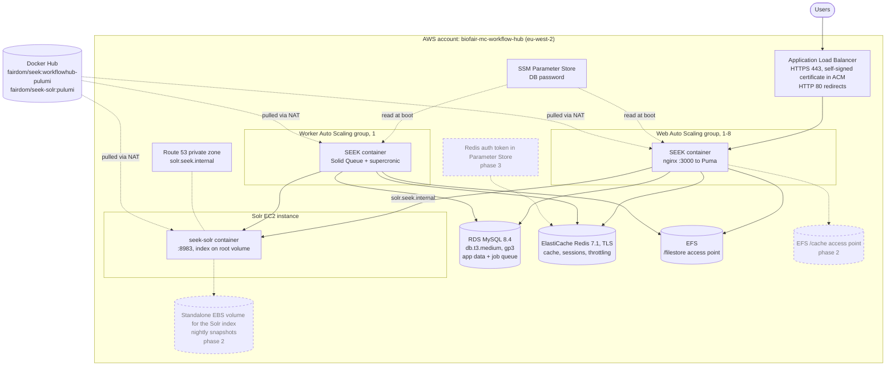
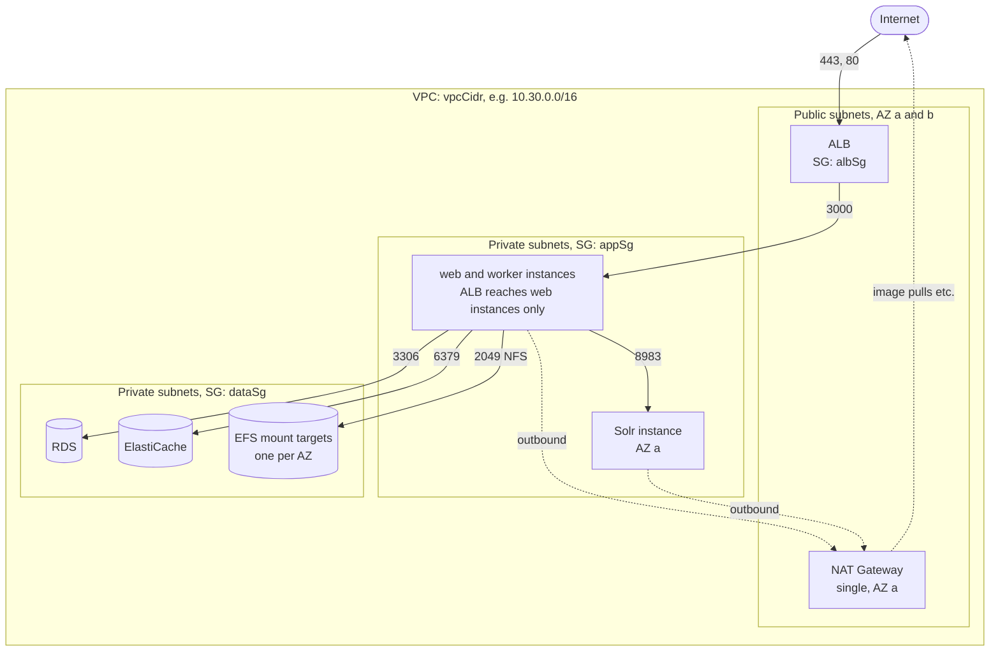
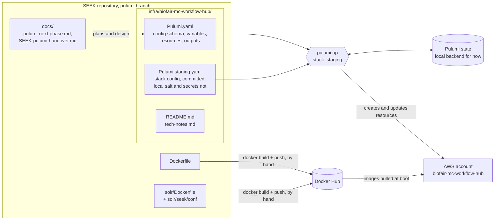

# WorkflowHub on AWS: Pulumi architecture

Diagrams of what the Pulumi project in
[`infra/biofair-mc-workflow-hub/`](../infra/biofair-mc-workflow-hub/) deploys,
and how the project is put together. For deploy steps, see the project's
[README](../infra/biofair-mc-workflow-hub/README.md) and
[`tech-notes.md`](../infra/biofair-mc-workflow-hub/tech-notes.md); for what
each later phase needs, [`pulumi-next-phase.md`](pulumi-next-phase.md); for the
original design, [`SEEK-pulumi-handover.md`](SEEK-pulumi-handover.md).

The diagrams show what is deployed to staging now: phase 1 and the completed
parts of phase 2. Parts still to come in phases 2 and 3 are drawn with dashed
outlines and labelled with their phase. Phase 4 (a real domain, backups,
CloudWatch logs, higher availability) is not shown.

## Services overview

The services and how they connect. Services with a thick border run as
multiple instances.

| Service | Runs as | Instances |
|---|---|---|
| Front-end | SEEK container on EC2, in an Auto Scaling group | 1-8, scaled on CPU (`webCount`, `webCountMax`, `webCpuTarget`) |
| Workers | SEEK container on EC2, in an Auto Scaling group | 1 (`workerCount`) |
| Solr | `fairdom/seek-solr` container on a dedicated EC2 instance | 1 |
| MySQL | RDS, managed | single instance |
| Redis | ElastiCache, managed | single node |
| Shared filestore | EFS, managed | mounted by every front-end and worker instance |

## Runtime architecture

How a request reaches SEEK, and which services each part of SEEK depends on.

| docker-compose service | AWS resource |
|---|---|
| `seek` | Web Auto Scaling group (`webGroup`) behind the load balancer |
| `seek_workers` | Worker Auto Scaling group (`workerGroup`), no ingress |
| `db` | RDS MySQL 8.4 (`db`) |
| `redis_store` | ElastiCache Redis replication group (`redis`) |
| `solr` | EC2 instance running `fairdom/seek-solr` (`solrInstance`); index on its root volume until phase 2 |
| `seek-filestore` volume | EFS filesystem with a `/filestore` access point |
| `seek-cache` volume | Each instance's own disk until phase 2 adds a shared `/cache` access point |

Each web and worker instance's user data mounts the filestore, reads the
database password from Parameter Store, writes the container environment,
and runs the SEEK container; see
[`tech-notes.md`](../infra/biofair-mc-workflow-hub/tech-notes.md).

## Network and security groups

Two Availability Zones, each with a public and a private subnet. Only the load
balancer and the NAT Gateway sit in public subnets.

| Security group | Inbound |
|---|---|
| `albSg` | 443 and 80 from anywhere |
| `appSg` | 3000 from `albSg`; 8983 from `appSg` itself |
| `dataSg` | 3306, 6379 and 2049 from `appSg` only |

No security group opens port 22. Every instance uses the account's existing
`ssm-instance-profile`, and administrative access is through SSM Session
Manager. The program creates no IAM resources.

## Planned: data and compute stacks (phase 3)

Phase 3 splits the program into two Pulumi stacks, so the compute can be
destroyed between uses without touching the data, and protects the database
and EFS with Pulumi's `protect: true`.

```mermaid
flowchart LR
    subgraph data["Data stack: long-lived"]
        vpc["VPC and subnets"]
        sgs["Security groups"]
        rds[("RDS<br/>protect: true")]
        efs[("EFS<br/>protect: true")]
        param["DB password parameter"]
        zone["Private DNS zone"]
        solrvol[("Solr data volume<br/>phase 2")]
    end

    subgraph compute["Compute stack: disposable"]
        nat["NAT gateway<br/>and default route"]
        alb["Load balancer<br/>certificate, listeners"]
        groups["Web and worker<br/>Auto Scaling groups"]
        solr["Solr instance<br/>and DNS record"]
        redis[("ElastiCache")]
    end

    data -- "stack reference:<br/>subnet and security group IDs,<br/>DB address, EFS IDs" --> compute

    classDef planned stroke-dasharray:5 5,color:#777
    class data,compute planned
```

## Project structure and deployment flow

What lives where in the SEEK repository, and how it becomes a running stack.

### Inside `Pulumi.yaml`

The program is a single Pulumi YAML file in four sections:

| Section | Contents |
|---|---|
| `config` | Per-stack settings: `environment`, `vpcCidr`, image tags, web and worker counts and the CPU target, instance sizes, database size and deletion settings, and the `dbPassword` secret |
| `variables` | The `namePrefix` (`biofair-mc-workflow-hub-<environment>`), Solr's DNS name, lookups of the SSM instance profile and the Amazon Linux AMI, and `hostSetup`, the web and worker instances' shared user data |
| `resources` | VPC and security groups; the password parameter, RDS, ElastiCache and EFS; the Solr instance and its private DNS name; the self-signed certificate and the load balancer; and the web and worker launch templates, Auto Scaling groups and the web scaling policy |
| `outputs` | Site URL, database and Redis endpoints, EFS ID, web and worker group names, Solr's private IP |

Every resource is tagged `Environment` and `ManagedBy: pulumi` through the AWS
provider's `defaultTags` in the stack config, and the instances and their disks
are named after their role (`<prefix>-web`, `-worker`, `-solr`).
