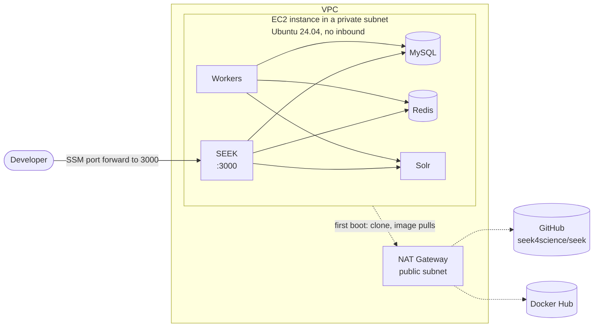
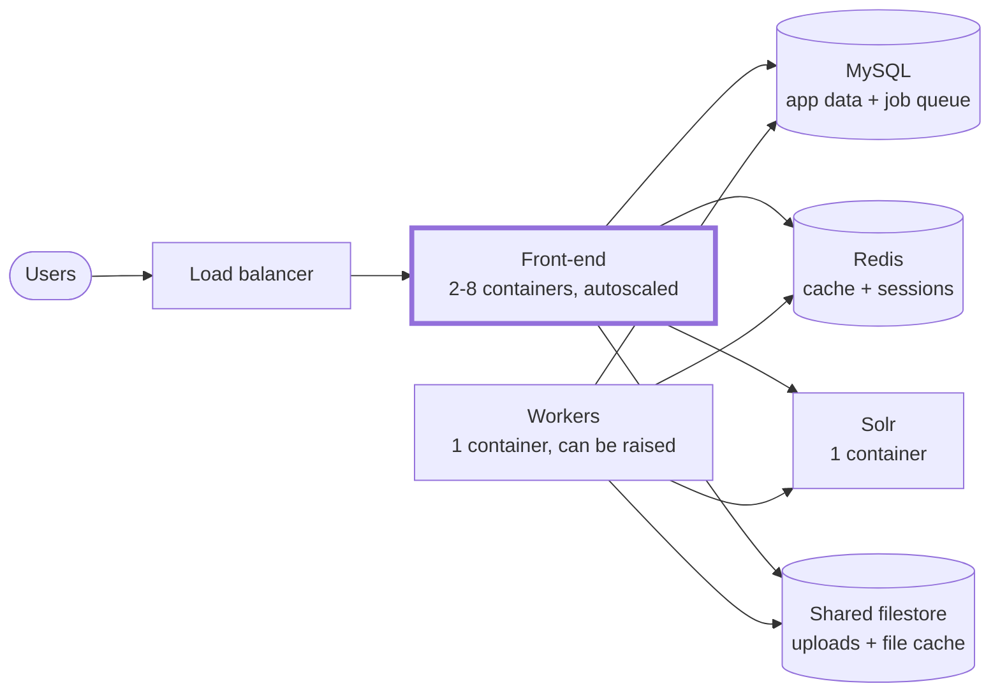
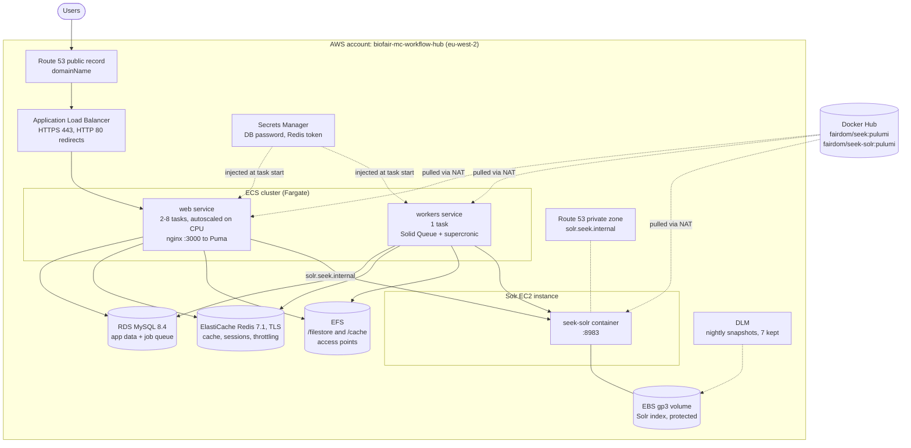
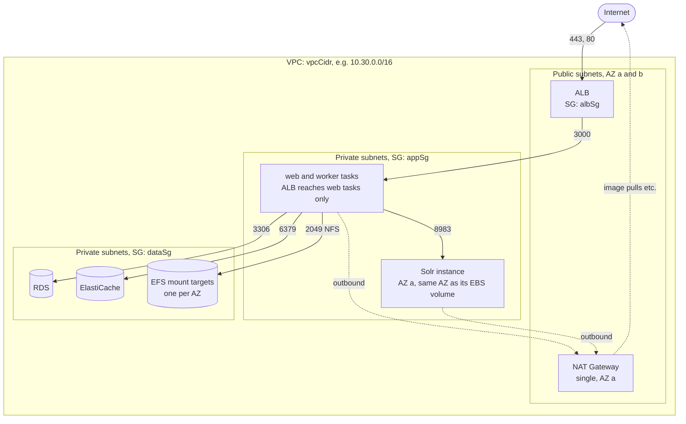
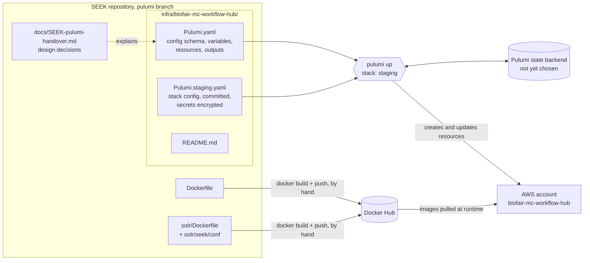

# WorkflowHub on AWS: Pulumi architecture

Diagrams of what the Pulumi project in
[`infra/biofair-mc-workflow-hub/`](../infra/biofair-mc-workflow-hub/) deploys,
and how the project is put together. For the reasoning behind the design, see
[`SEEK-pulumi-handover.md`](SEEK-pulumi-handover.md); for deploy steps, see the
project's [README](../infra/biofair-mc-workflow-hub/README.md).

Not yet deployed or previewed against AWS.

## Phase 1 on this branch: one EC2 instance

The program currently deploys a single instance running SEEK's
`docker-compose.yml`, not the managed-services design the rest of this
document shows. See the project
[README](../infra/biofair-mc-workflow-hub/README.md).

The sections below describe the managed-services design, a candidate for
phase 2.

## Services overview

The services and how they connect. Services with a thick border run as
multiple containers.

| Service | Runs as | Containers |
|---|---|---|
| Front-end | ECS Fargate service | 2-8, scaled on CPU |
| Workers | ECS Fargate service | 1, can be raised (`workerCount`) |
| Solr | Docker on a dedicated EC2 instance | 1 |
| MySQL | RDS, managed | n/a, single instance |
| Redis | ElastiCache, managed | n/a, single node |
| Shared filestore | EFS, managed | n/a, mounted by every front-end and worker container |

## Runtime architecture

How a request reaches SEEK, and which services each part of SEEK depends on.

| docker-compose service | AWS resource |
|---|---|
| `seek` | ECS Fargate service `web` behind the ALB |
| `seek_workers` | ECS Fargate service `workers`, no ingress |
| `db` | RDS MySQL 8.4 |
| `redis_store` | ElastiCache Redis replication group |
| `solr` | EC2 instance running `fairdom/seek-solr`, index on a standalone EBS volume |
| `seek-filestore`, `seek-cache` volumes | One EFS filesystem, two access points |

## Network and security groups

Two Availability Zones, each with a public and a private subnet. Only the load
balancer and the NAT Gateway sit in public subnets.

| Security group | Inbound |
|---|---|
| `albSg` | 443 and 80 from anywhere |
| `appSg` | 3000 from `albSg`; 8983 from `appSg` itself |
| `dataSg` | 3306, 6379 and 2049 from `appSg` only |

No security group opens port 22. Administrative access is through SSM Session
Manager: the Solr instance uses the account's existing `ssm-instance-profile`,
and ECS Exec is planned for the Fargate tasks.

## Project structure and deployment flow

What lives where in the SEEK repository, and how it becomes a running stack.

### Inside `Pulumi.yaml`

The program is a single Pulumi YAML file in four sections:

| Section | Contents |
|---|---|
| `config` | Per-stack settings: `environment`, `vpcCidr`, domain and certificate, image tags, task counts, instance sizes, and the `dbPassword`/`redisAuthToken` secrets |
| `variables` | Values shared between resources: the `namePrefix` (`biofair-mc-workflow-hub-<environment>`), the SEEK container environment and secrets, EFS volumes and mounts, and lookups of the Solr subnet, the AMI and the SSM instance profile |
| `resources` | Networking, security groups, secrets, RDS, ElastiCache, EFS, ECS cluster, load balancer and DNS, Solr instance and volume, snapshot policy, the two ECS services, and frontend autoscaling |
| `outputs` | Site URL, database and Redis endpoints, EFS ID, cluster name, Solr private IP |

Every resource is tagged `Environment` and `ManagedBy: pulumi` through the AWS
provider's `defaultTags` in the stack config.
