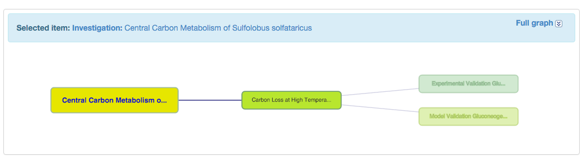
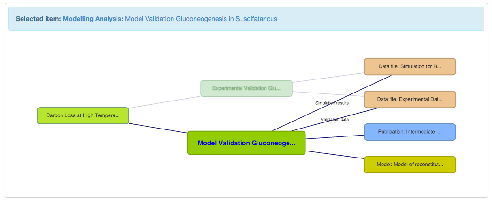

# A Quick Guide to Using ISA in SEEK

ISA stands for Investigations, Studies and Assays. It is the structure developed by the ISA-TAB community (http://isacommons.org/) and adopted by the SEEK to help you describe your data, experiments and models.  
In SEEK, you can upload or link to any data, models or protocols from your projects, but they don't normally exist in isolation. ISA provides a framework for expressing how the work in your projects fits together. For example, you may have transcriptomics, proteomics and metabolomics data which was all created to address the same biological problem.   
ISA also allows you to associate your data to the SOPs that were used to create them. For models, it allows linkage to construction or validation data sets. This makes it easier for others to interpret your results, or to repeat or validate your results when required.   
The aim of using the ISA structure is to ensure a complete record of the experiment and associated assets is available and accessible to other project members in a standard format.

## Investigations, Studies and Assays Defined

The following describes the purpose of each 'layer' in the structure, using examples from SysMO, and also from the public BioInvestigation Index database(BII http://www.ebi.ac.uk/bioinvindex/), which also uses the ISA structure for managing data

* **Investigation:** a high level description of the overall area of research. In SysMO, this may be the overall aims of the project, as stated on the sysmo.net website. If your project has several subprojects that do not share any data, you should define an investigation for each.
* BII Example: Growth control of the eukaryote cell: a systems biology study in yeast
* SysMO Example: Analysis of Central Carbon Metabolism of Sulfolobus solfataricus under varying temperatures
* **Study:** a particular biological hypothesis, which you are planning to test in various ways, using various techniques, which could be experimental, informatics, modelling, or a mixture
* BII Example: Study of the impact of changes in flux on the transcriptome, proteome, endometabolome and exometabolome of the yeast Saccharomyces cerevisiae under different nutrient limitations
* SysMO Example: Comparison of S. solfataricus grown at 70 and 80 degrees
* **Assay:** specific, individual experiments, measurements, or modelling tasks  
In SysMO, this may be a microarray experiment, or a flux balance analysis, for example
* BII Example:   
Transcriptional profiling  
DNA Microarray
* SysMO Example:   
Comparison of transcriptome 70 and 80c (Cdna microarray)  
Comparison of proteome at 70 and 80c (Protein expression profiling)  
Intracellular metabolomics of s. solfataricus at 70 and 80c (Metabolomics)

## Viewing Associations Between SEEK Assets

In SEEK, the ISA structure is displayed graphically, so you can see at a glance what items are associated with one another

The figure above shows the Investigation Glycerol Synthesis in Saccharomyces cerevisiae has one study, which in turn contains three different assays. If we zoom in on one particular assay, the Glycerol Synthesis Model Construction, we can see the SEEK downloadable assets it is associated with.

In this case, the Assay is not a laboratory experiment, but a modelling task. Referring to it as an assay is therefore confusing, so we call these Modelling Analyses instead of Assays. This modelling analysis has a publication and a model associated with it, as well as a data file that was used for model validation. The data file is also associated with another assay (Intracellular Metabolites). This assay describes how the validation data was originally produced. As you can see, it is possible to associate data files, models, and other SEEK assets with more than one assay if necessary.

## Using ISA when Uploading SEEK Assets

You can link assets to ISA descriptions, or vice versa, so it doesn't matter which you do first. Many projects prefer to have a higher level structure of Investigations and Studies defined from the beginning, so that new experiments can be linked up with little work for the uploader.

## Starting with your Data

We recommend using a JERM template to describe your data wherever available. We have a list of templates available here: https://seek.sysmo-db.org/help/templates   
If there is not a specific template for your type of data, consider using the general JERM master template. This template contains all the required JERM metadata elements, but not necessarily any technology-specific extensions. If you use and extend the JERM master for a particular type of experiment, please consider contributing those changes back to the consortium. Other people may wish to use your new template.  
If you have your data in any other format, you can still upload it to SEEK, but indexing will be limited, so subsequent searches will also be limited.

When uploading your data, you will be asked wish assay(s) it is associated with. If you have already described the assay in the SEEK, you can find it from the drop-down list and link it, if you have not yet described your assay, you can leave this step out for the time-being. If your data is JERM compliant, many of the metadata elements in the upload form are the same as those in the first JERM metadata sheet. Soon, these elements will be automatically populated from your file, but for now, you will be asked to specify them in the web interface.  
Once you have uploaded your data, you can create a new assay if necessary and link it back to your data. New assays can be associated with pre-existing Studies and Investigations, or new ones can be created as required.   
If you upload data without linking it to the ISA structure, you won't be able to link it to models or SOPs. You will receive a warning email for these orphan data files after they remain unlinked for more than 3 months.

  